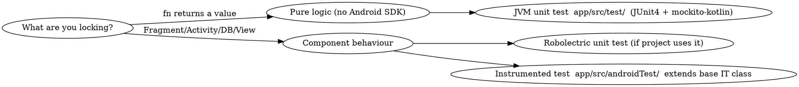

# Behaviour-Locking Tests (Mandatory Step)

A conversion is not done until a test proves behaviour did not change. If the Java class
already had tests, they are your primary safety net — run them and keep them green. If it
had none, you must add a **characterization test** that pins the current behaviour so the
refactor is provably safe.

## Decision Tree



**Prefer the seams you just created.** The idiomatic pass extracts pure functions
(link builders, permission math, partitioning, `isReshareForbidden`) specifically so they
can be unit-tested fast without a device. Test those first; they give the most behaviour
coverage per second.

## 1. JVM Unit Tests — Pure Functions

Location: `app/src/test/`. Fast, no emulator. Command:
`./gradlew jacocoTestGplayDebugUnitTest`.

Mark the function `@VisibleForTesting internal` so the test module can reach it while it
stays out of the public API.

```kotlin
/*
 * Nextcloud - Android Client
 *
 * SPDX-FileCopyrightText: 2026 Nextcloud GmbH and Nextcloud contributors
 * SPDX-License-Identifier: AGPL-3.0-or-later
 */
package com.owncloud.android.ui.fragment

import com.owncloud.android.lib.resources.status.OCCapability
import org.junit.Assert.assertEquals
import org.junit.Test
import org.mockito.kotlin.mock
import org.mockito.kotlin.whenever

class FileDetailSharingFragmentTest {

    @Test
    fun `internal link uses pretty path when modRewrite is on`() {
        val user = mock<User> { whenever(it.server.uri).thenReturn(URI("https://cloud.example")) }
        val file = mock<OCFile> { whenever(it.localId).thenReturn(42L) }
        val caps = mock<OCCapability> { whenever(it.modRewriteWorking.isTrue).thenReturn(true) }

        val link = FileDetailSharingFragment().createInternalLink(user, file, caps)

        assertEquals("https://cloud.example/f/42", link)
    }

    @Test
    fun `internal link falls back to index php path when modRewrite is off`() {
        // ... same setup with modRewriteWorking.isTrue == false
        // assertEquals("https://cloud.example/index.php/f/42", link)
    }
}
```

The point: run this test's logic against **both** the pre-conversion and post-conversion
code paths mentally (or, if the Java is still on disk, literally) and confirm the assertion
holds for both. That is what "behaviour must not change" means concretely.

## 2. Instrumented Tests — Component Behaviour

Location: `app/src/androidTest/`. For Fragment/Activity/DB behaviour that needs the Android
runtime. Extend the project's base test class (`AbstractOnServerIT` when server
communication is required) and follow its conventions (separate test user, etc.).

```bash
./gradlew createGplayDebugCoverageReport -Pcoverage=true \
  -Pandroid.testInstrumentationRunnerArguments.class=com.owncloud.android.ui.fragment.FileDetailSharingFragmentIT
```

Use `@VisibleForTesting` hooks the original exposed (e.g. a `search(query)` or
`showSharingMenuActionSheet(share)` method) to drive and assert UI state, exactly as the
existing IT suite does. Do not weaken visibility further than the Java original did.

## 3. What to Assert

Lock the observable contract, not the implementation:
- Same return values / thrown exception types for the same inputs (including the
  `require`/`requireNotNull` messages if callers depend on them).
- Same Bundle keys, intent extras, and `newInstance` argument wiring.
- Same branch outcomes (e.g. "reshare forbidden when FEDERATED", "show-all button visible
  only when > 3 shares").
- For coroutine conversions, assert the end state, and use the project's test dispatcher /
  `runTest` so async work is deterministic — never assert on wall-clock timing.

## 4. Guardrails

- Every new test file gets the SPDX header and ends with exactly one trailing newline.
- Do not modify unrelated tests to make yours pass.
- Report actual test output. If a test reveals the conversion changed behaviour, fix the
  conversion — do not adjust the test to match the drift.
- If a genuine pre-existing bug is uncovered, surface it to the developer separately; do
  not fold a behaviour change into the conversion.
