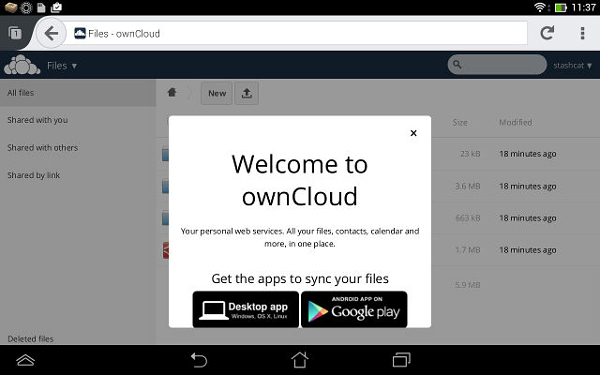
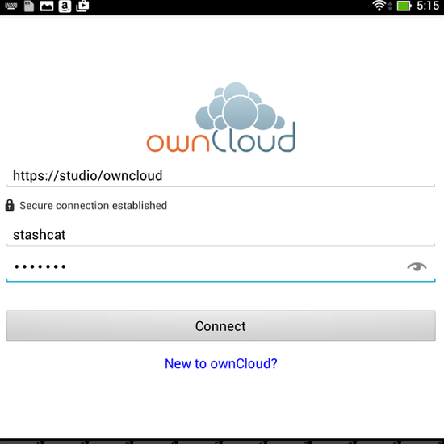
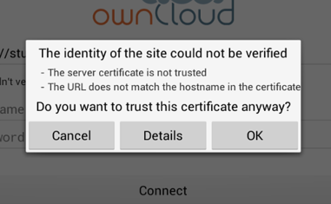
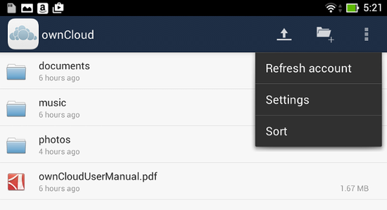
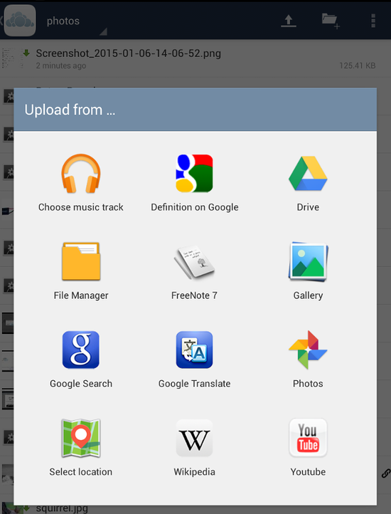
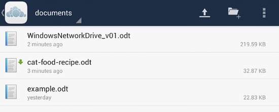
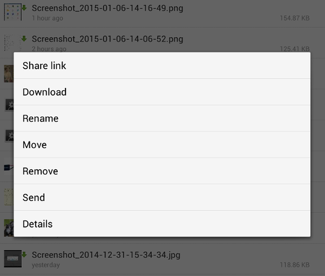
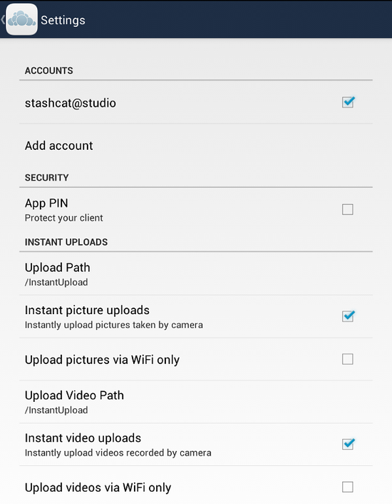
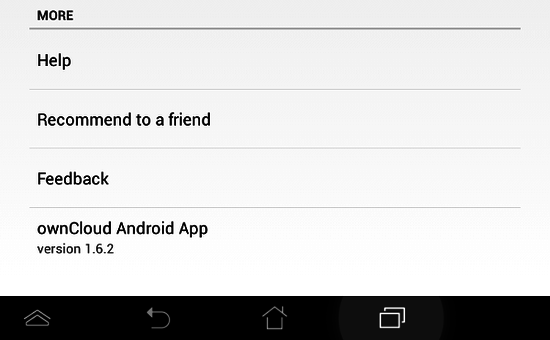

==============================
Using the ownCloud Android App
==============================

Accessing your files on your ownCloud server via the Web interface is easy and 
convenient, as you can use any Web browser on any operating system without 
installing special client software. However, the ownCloud Android app offers 
some advantages over the Web interface:

* A simplified interface that fits nicely on a tablet or smartphone
* Automatic synchronization of your files
* Instant uploads of photos or videos recorded on your Android device
* Easily add files from your device to ownCloud
* Two-factor authentication

Getting the ownCloud Android App
--------------------------------

One way to get your ownCloud Android app is to log into your ownCloud server 
from your Android device using a Web browser such as Chrome, Firefox, or 
Dolphin. The first time you log in to a new ownCloud account you'll see a screen 
with a download link to the ownCloud app in the `Google Play store
<https://play.google.com/store/apps/details?id=com.owncloud.android>`_.

You will also find these links on your Personal page in the Web interface,

You can also get it from the `Amazon App store 
<http://www.amazon.com/ownCloud-Inc/dp/B00944PQMK/>`_, and get source code and 
more information from the `ownCloud download page 
<http://owncloud.org/install/#mobile>`_.

Connecting to Your ownCloud Server
----------------------------------

The first time you run your ownCloud Android app it opens to a configuration 
screen. Enter your server URL, login name, password, and click the Connect 
button. (Click the eyeball to the right of your password to expose your 
password.)

For best security your ownCloud server should be SSL-enabled, so that you can 
connect via ``https``. The ownCloud app will test your connection as soon as 
you enter it and tell you if you entered it correctly. If your server has a 
self-signed SSL certificate you'll get a scary warning how it is not to be 
trusted. Click the OK button to accept the certificate and complete your account 
setup.

Managing Files
--------------

Now you should see the Files page of your ownCloud account. Click the overflow 
button at the top right (that's the one with three vertical dots, and that is 
really what it is called) to open a user menu. ``Refresh account`` refreshes the 
page view. ``Settings`` take you to your settings menu. ``Sort`` gives you the 
option to sort your files by date, or alphabetically.

The little file folder icon to the left of the overflow button opens a dialog to 
create a new folder. The arrow button opens a file upload dialog, and you can 
either upload content from other Android apps such as Google Drive, the Gallery, 
your music player, or from your Android filesystem. When you add a new file 
you will see a confirmation on the top left when it has uploaded successfully, 
and it is immediately synchronized with the server.

All files (that you have permission to access) on your ownCloud server are 
displayed in your Android app, but are not downloaded until you download them. 
Downloaded files are marked with a green arrow.

Download and preview a file with a short press on the filename.  When the file 
is in preview mode, a short press on the overflow button opens a menu with 
options for sharing, opening with an app, removing, sending, and displaying file 
details. 

A long press on the filename does not download it, but opens a dialog with 
options for sharing, downloading, renaming, moving, removing, sending, and 
viewing file details. 

Settings
--------

The Settings screen offers a number of useful options. In the Accounts 
section you can configure multiple ownCloud accounts.

The Security section sets up strong two-factor authentication by allowing you 
to add a PIN (personal identification number) to access your account.  

The Instant Uploads section creates a directory, :file:`/InstantUpload`, and 
any photos or videos created with your Android device's camera are instantly 
uploaded to this directory. You also have the option to choose any other 
existing directory. Another nice option is Upload Pictures/Video via WiFi Only, 
to conserve your Internet data usage.

The bottom section of the Settings screen has links to help and the 
app's version number.

