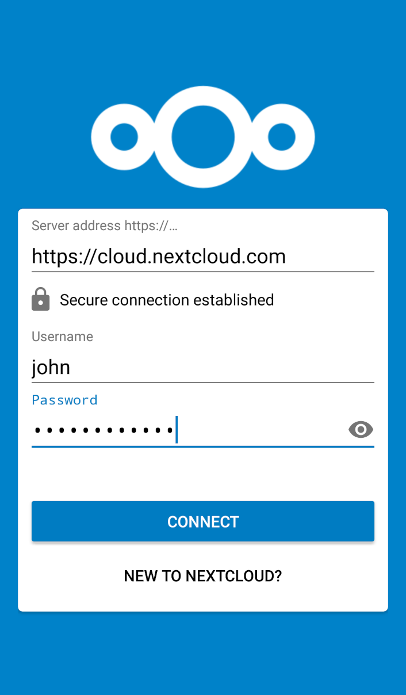
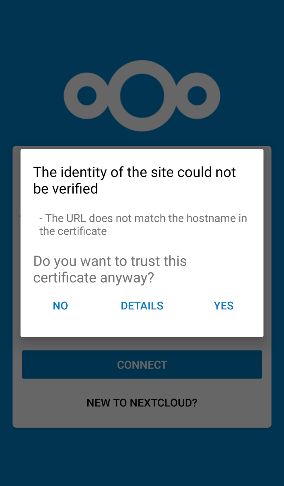
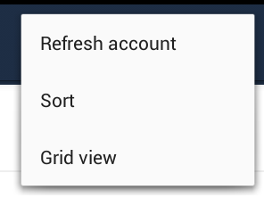
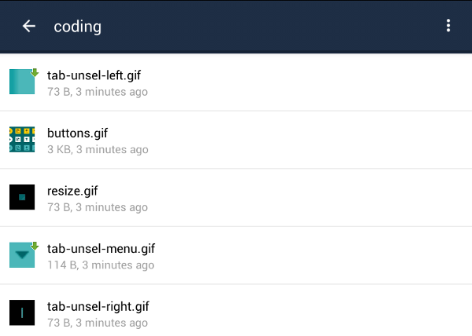
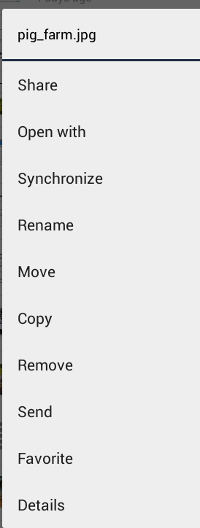
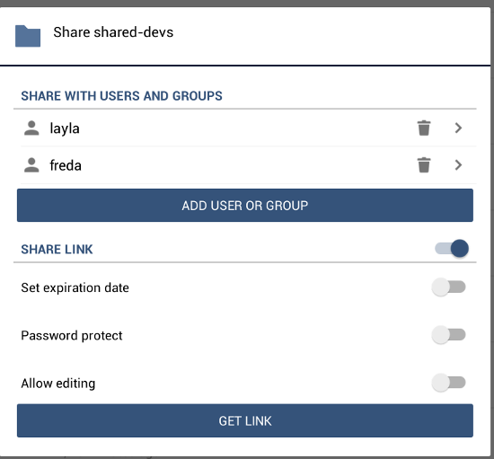

===============================
Using the Nextcloud Android App
===============================

Accessing your files on your Nextcloud server via the Web interface is easy and 
convenient, as you can use any Web browser on any operating system without 
installing special client software. However, the Nextcloud Android app offers 
some advantages over the Web interface:

* A simplified interface that fits nicely on a tablet or smartphone
* Automatic synchronization of your files
* Share files with other Nextcloud users and groups, and create public share 
  links
* Instant uploads of photos or videos recorded on your Android device
* Easily add files from your device to Nextcloud 
* Two-factor authentication

New In Version 1.0.0
--------------------

This release contains a number of improvements, including:

* View status of uploads and manage failures
* Federated sharing is now supported with users on Nextcloud servers
* UI improvements, following Material Design lines
* Share-by-link folders are editable
* Instant uploads automatically stop when Wifi connection is interrupted
* Server certificate warnings are supported
* Improvement when other apps send files to Nextcloud 
* Bug fixes

Upgrading
---------

When you download your Nextcloud Android App from the Google Play store, it will 
be upgraded just like any other Play Store app, according to your settings on 
your Android device. It will either upgrade automatically, or give you a 
notification than an upgrade is available.

If you are using an Nextcloud Android app from a custom repository, e.g. your 
employer, then you will upgrade according their policies.

Getting the Nextcloud Android App
---------------------------------

One way to get your Nextcloud Android app is to log into your Nextcloud server 
from your Android device using a Web browser such as Chrome, Firefox, or 
Dolphin. The first time you log in to a new Nextcloud account you'll see a screen 
with a download link to the Nextcloud app in the `Google Play store
<https://play.google.com/store/apps/details?id=com.nextcloud.client>`_.

.. figure:: images/android-1.png
   :alt: Android app new account welcome screen.

You will also find these links on your Personal page in the Nextcloud Web interface.

Find source code and more information from the `Nextcloud download page 
<https://nextcloud.com/install/#mobile>`_.

Users of customized Nextcloud Android apps, for example from their employer, 
should follow their employer's instructions.

Connecting to Your Nextcloud Server
-----------------------------------

The first time you run your Nextcloud Android app it opens to a configuration 
screen. Enter your server URL, login name, password, and click the Connect 
button. (Click the eyeball to the right of your password to expose your 
password.)

For best security your Nextcloud server should be TLS-enabled, so that you can 
connect via ``https``. The Nextcloud  app will test your connection as soon as 
you enter it and tell you if you entered it correctly. If your server has a 
self-signed SSL certificate you'll get a warning that it is not to be 
trusted. Click the OK button to accept the certificate and complete your account 
setup.

Managing Files
--------------

Now you should see the Files page of your Nextcloud account. Note some 
differences from the previous release: click the blue button at the bottom 
right to expose the **Upload**, **Content from other apps**, and **New folder** 
buttons.

Use the **Upload** button to add files to your Nextcloud account from your 
Android filesystem. Use **Content from other apps** to upload files from 
Android apps, such as the Gallery app.

.. figure:: images/android-4.png 
   :alt: Your Nextcloud Files page.
   
Click the overflow button at the top right (that's the one with three vertical 
dots) to open a user menu. **Grid view** toggles between grid and list 
view. **Refresh account** syncs with the server, and **Sort** 
gives you the option to sort your files by date, or alphabetically.

The Nextcloud menu at the top left shows the name of the logged-in user, has a 
shortcut to your files, the **Uploads** button, and the **Settings** button.

The Uploads page displays the status of files currently uploading, a list of 
your recently-uploaded files, and a Retry option for any failed uploads. If 
credentials to access the file have changed, you'll see a credentials error. 
Tap the file to retry, and you'll get a login screen to enter the new 
credentials. 

If the upload fails because you're trying to upload to a folder that you do not 
have permission to access, you will see a "Permissions error". Change the 
permissions on the folder and retry the upload, or cancel and then upload the 
file to a different folder.

All files (that you have permission to access) on your Nextcloud server are 
displayed in your Android app, but are not downloaded until you click on them. 
Downloaded files are marked with a green arrow.

Download and view a file with a short press on the filename.  Then a short 
press on the overflow button opens a menu with options for managing your file.

.. figure:: images/android-9.png
   :alt: File management options. Betsy Ross says "Don't believe everything you 
    read on the Internet."
   
When you are on your main Files page, a long press on any file or folder 
displays a list of options: **Share**, **Open With**, **Synchronize**, 
**Rename**, **Move**, **Copy**, **Remove**, **Send**, **Favorite**, and 
**Details**.

   
Click **Share** to share files. You can share with other Nextcloud users and 
groups, and create public share links. If your Nextcloud server administrator 
has enabled username auto-completion, when you start typing user or group names 
they will auto-complete. After you have shared files, click the **Share** button 
to see who you have shared with, and to remove shares.

   
Create a Federated share link by clicking **Add User or Group** and entering 
the username and remote URL of the person you want to share with in this 
format: user@domain.com. You don't have to guess; the Personal page in the 
Nextcloud Web GUI tells the exact Federated Cloud ID. Just ask them to copy and 
paste and send it to you.

   
Settings
--------

Use the **Settings** screen to control your Nextcloud app functions. 

.. figure:: images/android-10.png
   :alt: Setting screen.

In the **Accounts** section you can set up and manage multiple accounts.

The **Security** section sets up strong two-factor authentication by allowing 
you to add a PIN (personal identification number) to access your account.  

The **Instant Uploads** section creates a directory, :file:`/InstantUpload`, and 
any photos or videos created with your Android device's camera are instantly 
uploaded to this directory. You also have the option to choose any other 
existing directory, or to create a new one. Another nice option is **Upload 
Pictures/Video via WiFi Only**, to conserve your mobile data usage.

The bottom section of the **Settings** screen has links to **Help**, 
**Recommend to a friend**, **Feedback**, and the version number.

Removing/Logging Out
--------------------

On your Settings page, a long press on an account name opens a dialog to 
**Change password** or **Remove account**. **Change password** is, of course, 
changing your password.

**Remove account** logs you out of the server, removes your account settings, 
and removes your files from your Android device. It does not change anything on 
the server. There is no logout function that simply logs out of your account 
and leaves all your files on your Android device. If you want extra security, 
you can set a login PIN on your Android device, and also on your Nextcloud 
account. If you are using a shared Android device, other users can access your 
files in the file manager if you are sharing a single user account, so you 
could set up multiple user accounts to protect your files.

Sync calendar and contacts
--------------------------

The Nextcloud Android app provides an integration to setup a sync of Androids
calendars and contacts with the Nextcloud server. To set this up go to the
Nextcloud app and open the settings via the left menu. Scroll down there to the
entry "Sync calendar & contacts".

When clicking this and the DAVDroid app is not installed it will open the
Google Play Store or the F-Droid store to let you install this app (if none of
them is installed the DAVDroid website is opened). This app provides the sync
mechanism for the calendars and contacts.

When clicking the menu entry "Sync calendar & contacts" and the DAVDroid app is
installed it will open the configuration of the DAVDroid app prefilled with the
account information from the Nextcloud app. You only need to specify the
password.

After entering the password you need to specify an email address that is used as
owner for calendar events you create.

Now the sync is set up and your phones calendars and contacts are synced with the
Nextcloud server.
