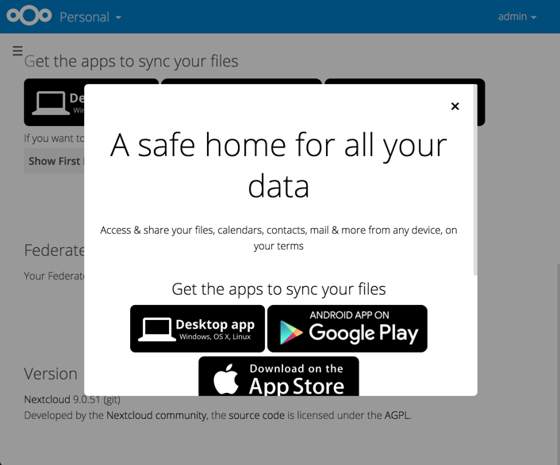
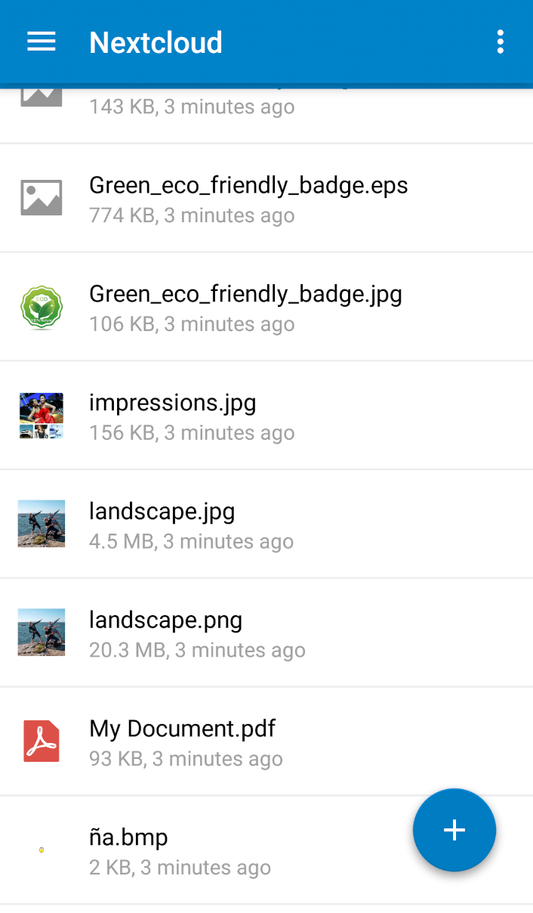
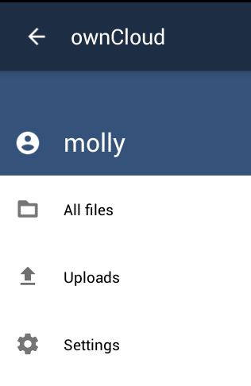
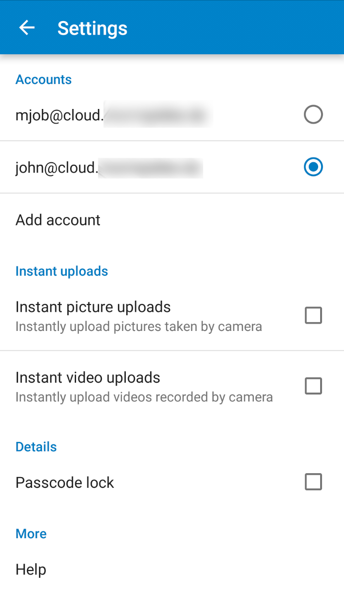

==============================
Using the ownCloud Android App
==============================

Accessing your files on your ownCloud server via the Web interface is easy and 
convenient, as you can use any Web browser on any operating system without 
installing special client software. However, the ownCloud Android app offers 
some advantages over the Web interface:

* A simplified interface that fits nicely on a tablet or smartphone
* Automatic synchronization of your files
* Share files with other ownCloud users and groups, and create public share 
  links
* Instant uploads of photos or videos recorded on your Android device
* Easily add files from your device to ownCloud
* Two-factor authentication

Getting the ownCloud Android App
--------------------------------

One way to get your ownCloud Android app is to log into your ownCloud server 
from your Android device using a Web browser such as Chrome, Firefox, or 
Dolphin. The first time you log in to a new ownCloud account you'll see a screen 
with a download link to the ownCloud app in the `Google Play store
<https://play.google.com/store/apps/details?id=com.owncloud.android>`_.

You will also find these links on your Personal page in the ownCloud Web interface.

Find source code and more information from the `ownCloud download page 
<http://owncloud.org/install/#mobile>`_.

Connecting to Your ownCloud Server
----------------------------------

The first time you run your ownCloud Android app it opens to a configuration 
screen. Enter your server URL, login name, password, and click the Connect 
button. (Click the eyeball to the right of your password to expose your 
password.)

.. figure:: images/android-2.png
   :scale: 75% 
   :alt: New account creation screen.

For best security your ownCloud server should be SSL-enabled, so that you can 
connect via ``https``. The ownCloud app will test your connection as soon as 
you enter it and tell you if you entered it correctly. If your server has a 
self-signed SSL certificate you'll get a warning that it is not to be 
trusted. Click the OK button to accept the certificate and complete your account 
setup.

.. figure:: images/android-3.png 
   :alt: SSL certificate warning.

Managing Files
--------------

Now you should see the Files page of your ownCloud account. 

The ownCloud menu at the top left shows the name of the logged-in user, has a 
shortcut to your files, and contains the Settings button.

Click the overflow button at the top right (that's the one with three vertical 
dots) to open a user menu. ``Refresh account`` syncs your files, and ``Sort`` 
gives you the option to sort your files by date, or alphabetically.

.. figure:: images/android-6.png
   :alt: Top-right menu.

The little file folder icon to the left of the overflow button opens a dialog to 
create a new folder. The arrow button opens a file upload dialog, and you can 
either upload content from other Android apps such as Google Drive, the Gallery, 
your music player, or from your Android filesystem.

.. figure:: images/android-7.png
   :scale: 75%
   :alt: File upload dialogue.

All files (that you have permission to access) on your ownCloud server are 
displayed in your Android app, but are not downloaded until you click on them. 
Downloaded files are marked with a green arrow.

.. figure:: images/android-8.png
   :scale: 75%
   :alt: Downloaded files are marked with green arrows.

Download and view a file with a short press on the filename.  Then a short 
press on the overflow button opens a menu with options for managing your file.

    read on the Internet."
   
When you are on your main Files page, a long press on any file or folder 
displays a list of options: Share, Open With, Synchronize, Rename, Move, Copy, 
Remove, Send, Favorite, and Details.

.. figure:: images/android-11.png
   :scale: 75%
   :alt: Folder and file management options.
   
Click Share to share files. You can share with other ownCloud users, and create 
public share links. If your ownCloud server administrator has enabled username 
auto-completion, when you start typing user or group names they will 
auto-complete. After you have shared files, click the Share button to see who 
you have shared with, and to remove shares.

.. figure:: images/android-12.png
   :scale: 75%
   :alt: Sharing files.
   
Settings
--------

Use the Settings screen to control your ownCloud app functions.

In the Accounts section you can set up and manage multiple accounts.

The Security section sets up strong two-factor authentication by allowing you 
to add a PIN (personal identification number) to access your account.  

The Instant Uploads section creates a directory, :file:`/InstantUpload`, and any 
photos or videos created with your Android device's camera are instantly 
uploaded to this directory. You also have the option to choose any other 
existing directory, or to create a new one. Another nice option is Upload 
Pictures/Video via WiFi Only, to conserve your mobile data usage.

The bottom section of the Settings screen has links to Help, Recommend to a 
friend, Feedback, and the version number.
